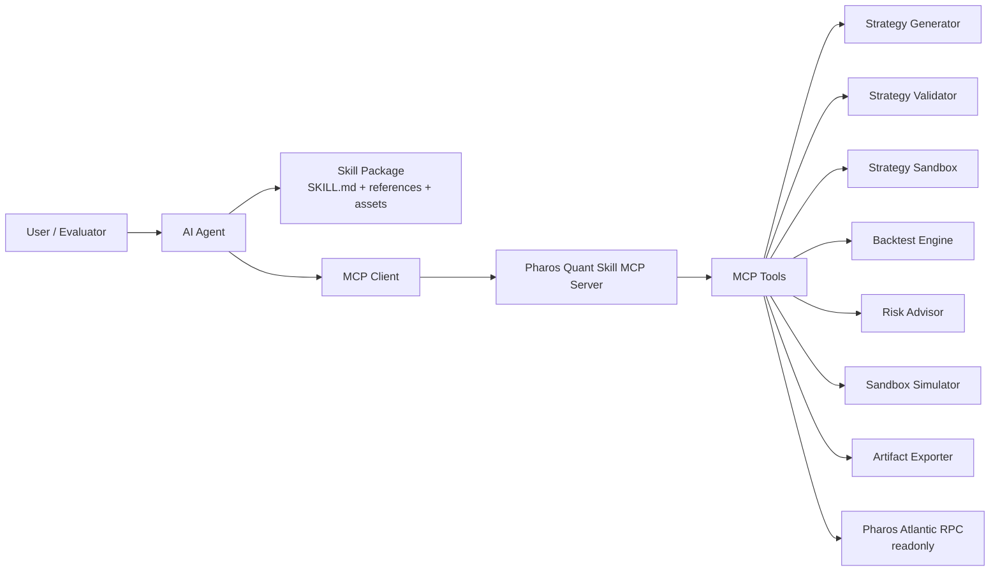
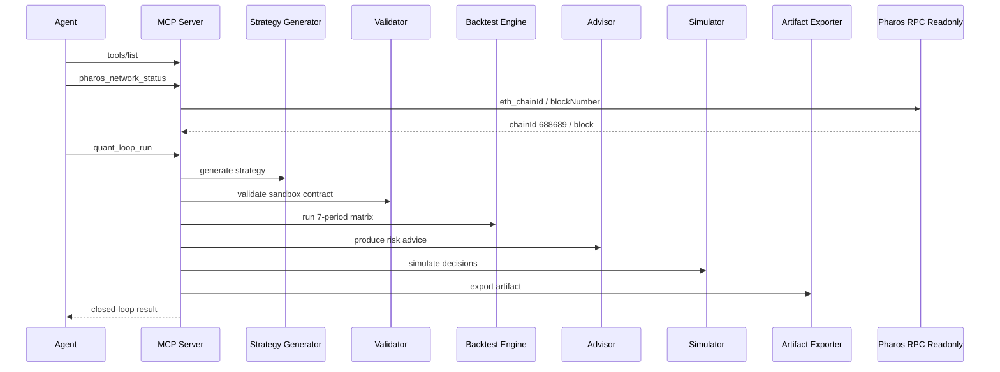
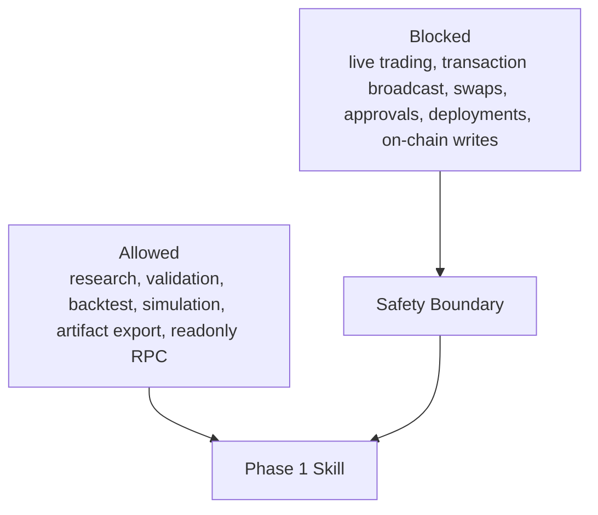

# Architecture

## High-Level Flow

## Runtime Responsibilities

The Skill package layer helps Agents understand the capability:

- `SKILL.md`
- `references/`
- `assets/`

The MCP runtime layer executes the capability:

- `tools/list`
- `tools/call`
- strategy lifecycle tools
- Pharos read-only tools

## Data Flow

## Phase 1 Boundary

## Phase 2 Extension Point

Future Phase 2 Agents can consume exported strategy artifacts and combine them with wallet, oracle, DEX, or execution Skills under strict risk controls.

Execution should remain a separate disabled-by-default module with Atlantic Testnet guards, max notional limits, slippage limits, dry-run transaction plans, and explicit confirmation.
